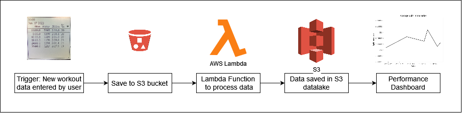

# Introduction

This project aims to build a completely working data pipeline that takes in the workout data from a Concept 2 Indoor Rower Erg screen to produce analyses where the user can easily see performance trends.

## Architecture

## Working Improvements
* Any TODO tags
* Better organisation of functions into different files
* Addition of main.py to run all scripts
* Modifying testprocess content to deploy on AWS Lambda